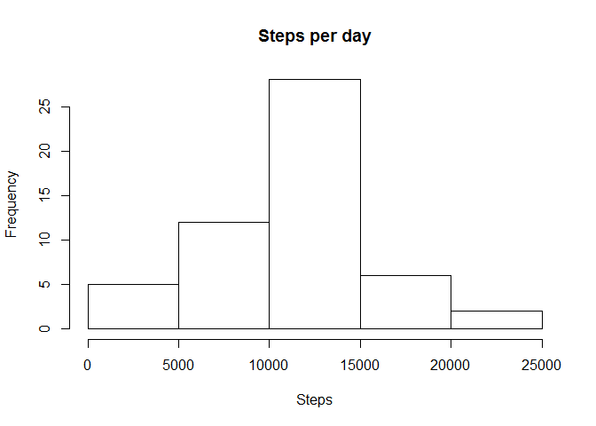
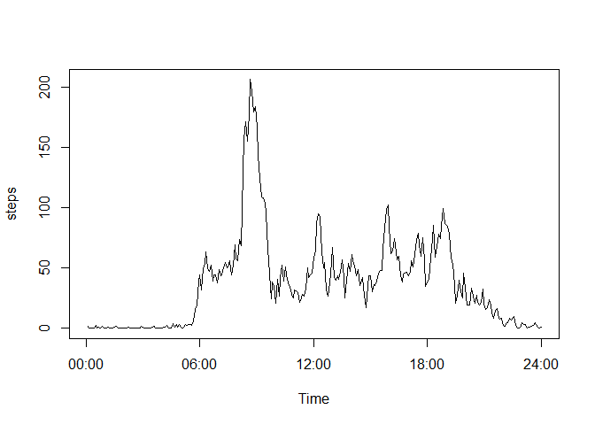
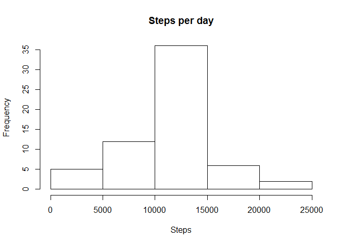
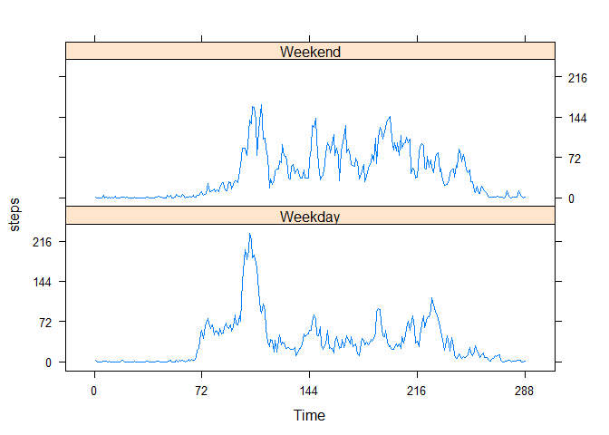

# Reproducible Research: Peer Assessment 1


## Loading and preprocessing the data

```r
# setwd("DataScienceCoursera/RepData_PeerAssessment1/")
# unzip("activity.zip")
dd <- read.table("activity.csv", stringsAsFactors=FALSE, sep=",", head= TRUE)
dd$date <- as.Date(dd$date, format="%Y-%m-%d")
str(dd)
```

```
## 'data.frame':	17568 obs. of  3 variables:
##  $ steps   : int  NA NA NA NA NA NA NA NA NA NA ...
##  $ date    : Date, format: "2012-10-01" "2012-10-01" ...
##  $ interval: int  0 5 10 15 20 25 30 35 40 45 ...
```

## What is mean total number of steps taken per day?
Prepare dataset of daily steps

```r
agg <- aggregate(steps ~ date, data=dd, sum)
```

Histogram of daily steps

```r
hist(agg$steps, main="Steps per day", xlab="Steps")
```

 
Mean

```r
mean(agg$steps)
```

```
## [1] 10766
```
Median

```r
median(agg$steps)
```

```
## [1] 10765
```


## What is the average daily activity pattern?
Create dataset of average steps per 5 minute time chunk

```r
agg <- aggregate(steps ~ interval, data=dd, mean, na.rm=TRUE)
```

Use chron:::time to define a time series and avoid stright stretches representing the nonexistant 45 mins between HH55 and HH00.


```r
library(chron)
```

```
## Warning: package 'chron' was built under R version 3.1.2
```

```r
agg$t <- time(agg$interval)
```


```r
plot(steps ~ t, agg, type="l", xaxt="n", xlab="Time")
axis(1, at=seq(0, nrow(agg), 72), labels=c("00:00", "06:00", "12:00", "18:00", "24:00"))
```

 

Most steps at 

```r
agg$interval[agg$steps == max(agg$steps)]
```

```
## [1] 835
```
which presumably corresponds to the travel to work.

## Imputing missing values
Vector of mean values matching the appropriate values in original data...

```r
steps <- agg$steps[match(dd$interval, agg$interval)]
```

Replace missing values by the mean value at that time point

```r
dd2 <- dd
dd2$steps[is.na(dd2$steps)] <- steps[is.na(dd2$steps)]
```

Histogram of mean steps per day

```r
agg <- aggregate(steps ~ date, data=dd2, sum)
```

Histogram of daily steps

```r
hist(agg$steps, main="Steps per day", xlab="Steps")
```

 


## Are there differences in activity patterns between weekdays and weekends?


```r
dow <- day.of.week(month = as.numeric(format(dd2$date, format = "%m")), day = as.numeric(format(dd2$date, format = "%d")), year = as.numeric(format(dd2$date, format = "%Y")))

dd2$weekend <- dow %in% c(0,6)
dd2$weekend[dd2$weekend] <- "Weekend"
dd2$weekend[dd2$weekend=="FALSE"] <- "Weekday"

agg <- aggregate(steps ~ interval + weekend, dd2, mean)

for(i in c("Weekend", "Weekday")){
  agg$t[agg$weekend == i] <- time(agg$interval[agg$weekend == i])
}

library(lattice)
```

```
## Warning: package 'lattice' was built under R version 3.1.2
```

```r
xyplot(steps ~ t | weekend, data= agg, layout=c(1, 2), scales=list(at=seq(0, nrow(agg), 72), labels=c("00:00", "06:00", "12:00", "18:00", "24:00")), xlab="Time", type="l")
```

 

As one might expect, the user was generally up earlier during the weekdays and was generally less active throughout the day than at weekends.


